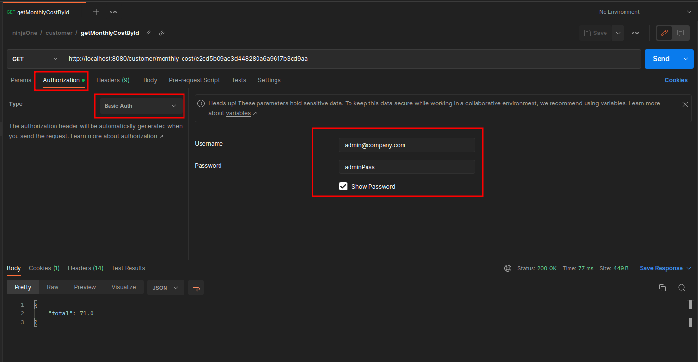
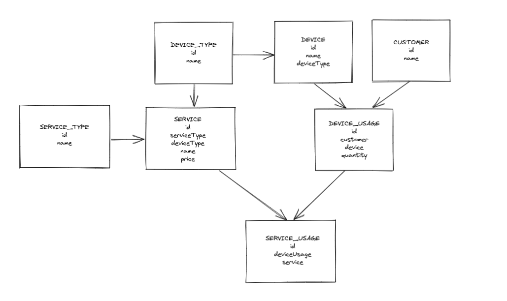

# RMM-Backend
The purpose of this project is to show my technical skills to create a well-structured project, using concepts of design patterns and clean code.

## Technical explanations
### Java 17
The intention of using java 17 is to always develop applications with one of the latest versions of java available, to avoid rework in the future.
### Lombok
Lombok comes with the intention of being a great ally in java development, making the code simpler.
### Swagger
Every project needs technical documentation, I consider Swagger the best of them.
### Githook
Force unit tests to run on every commit and push, so that jenkins resources are not wasted unnecessarily.
### Semver
It is interesting to have an automatic semantic versioning manager to be used in pipelines.

## Modules
This application is structured in 3 modules.
### app
Application presentation layer, where spring dependencies are located and also the http resources.
### model
Application model layer, where the entities, DTOs, enumerations and related resources are located.

## How to use the application
### Build
To build the application:
```shell
./gradlew clean build      
```
### Starting the application
#### Running locally
Run the `RmmBackendApplication` class
#### Docker
To start the application into a docker container:
```shell
docker compose up
```
### Health check
To check application health:
```
http://localhost:8080/actuator/health
```
### Swagger
To check the technical documentation:
```
http://localhost:8080/swagger-ui/index.html
```
### Authentication
To authenticate, enter the following credentials:
```yml
username: admin@company.com 
password: adminPass
```
To authenticate using postman:



Using an authenticated endpoint with curl:
```shell
curl -u admin@company.com:adminPass http://localhost:8080/customer | jq
```

### H2 Console
In order to see and interact with your db, access the h2 console in your browser.
After running the application, go to:
```
http://localhost:8080/h2-console
```
Enter the information for the url, username, and password in the application.yml:
```yml
url: jdbc:h2:mem:localdb
username: sa 
password: password
```
You should be able to see a db console now that has the Sample Repository in it.

Type:
```sql
SELECT * FROM CUSTOMER;
```
Click `Run`.

### Semantic versioning
To increment patch:
```shell
./gradlew incrementPatch     
```
To increment minor:
```shell
./gradlew incrementMinor
```
To increment major:
```shell
./gradlew incrementMajor
```

## UML
Here is the application data modeling.



## Technical debt
### Tests
Increase the coverage of tests.
### Spring security
Use a feature to manage security credentials without having to use hardcoded credentials.
### User role
Implement different access types by role.
### Creating core module
Layer where the application's business rules are presented.
All external dependencies must be interfaced, it is not allowed to have a direct dependency with spring, database, etc.
The purpose of this layer is to follow the hexagonal architecture and ensure that business rules are not interfered with by the technologies used,
making it easier to replace them with other types of resources, as long as they respect the defined contract.
### Paginated query
It is recommended for listing endpoints to use pagination.